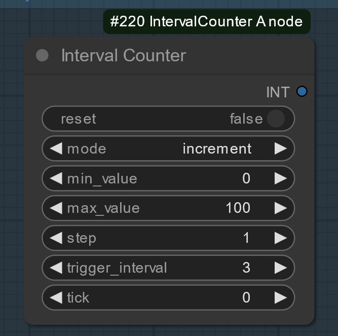

# ComfyUI-Counternodes
此节点组内含一系列拥有内置计数器与根据计数器输出结果输出特定结果的ComfyUI节点，目的是为了在ComfyUI的前端实现文件夹的遍历功能。具体实例请参照示例工作流，当然你也可以发挥自己的想象力创造其他有趣的东西。
This node group contains a series of ComfyUI nodes with built-in counters and specific output results based on the counter's output, aimed at implementing folder traversal functionality in the ComfyUI frontend. For specific examples, please refer to the sample workflow. Of course, you can also use your imagination to create other interesting things.

使用方法：将上方6个节点文件夹全部复制黏贴到ComfyUI的Custom_nodes文件夹内即可使用。
Usage: Copy all six node folders mentioned above and paste them into the ComfyUI Custom_nodes folder to start using them.

节点功能与示意工作流：

1：IntervalCounter A node

此节点拥有一个内置计数器，可根据trigger_interval（触发间隔）的输入值来完成在特定触发间隔后才进行常规计数器的递增（increment）、递减（decrement）、递增至最大值（inc_to_max）、递减至最小值（dec_to_min）特定的步数（step）
各项参数详解：

reset：重置功能，启用后节点内置计数器值将归零，可外接布尔值来调控

mode：在完成特定触发间隔后计数器执行的模式（常用递增increment）

min_value（最小值）：最小可设定值为0（最小值与最大值仅在inc_to_max与dec_to_min模式下才会启用，在递增、递减模式下不会被启用）

max_value（最大值）：就是最大值啊

step（步数）：完成特定触发间隔后计数器执行的步数

trigger_interval（触发间隔）：由内置计数器先进行计算的触发间隔（e：当trigger_interval=3、step=1、mode为increment时，本节点的最终输出值要过3轮才会加1）

tick（用来外接诸如wasnodesuite包的计数节点的端口）：由于此节点目前并没有设定保持脏状态的功能，所以要通过此端口再外接一个其他的诸如wasnodesuite包的计数节点之类哈希值保持变动的节点来保持节点的哈希值持续更新，从而不会被ComfyUI忽略掉，此端口输入的计数值并不会纳入实际运算中，仅仅是为获取一个持续变动的哈希值而已）

2：image_counter node

3：load_prompt_txt node

4：IntervalCounter B node

5：alternating_output A node

6：alternating_output B node

