# ComfyUI-Counternodes
此节点组内含一系列拥有内置计数器与根据计数器输出结果输出特定结果的ComfyUI节点，目的是为了在ComfyUI的前端实现文件夹的遍历功能。具体实例请参照示例工作流，当然你也可以发挥自己的想象力创造其他有趣的东西。

This node group contains a series of ComfyUI nodes with built-in counters and specific output results based on the counter's output, aimed at implementing folder traversal functionality in the ComfyUI frontend. For specific examples, please refer to the sample workflow. Of course, you can also use your imagination to create other interesting things.

使用方法：将上方6个节点文件夹全部复制黏贴到ComfyUI的Custom_nodes文件夹内即可使用。

Usage: Copy all six node folders mentioned above and paste them into the ComfyUI Custom_nodes folder to start using them.

节点功能与示意工作流：（nodes function and workflow examples）

1：IntervalCounter A node

此节点拥有一个内置计数器，可根据trigger_interval（触发间隔）的输入值来完成在特定触发间隔后才进行常规计数器的递增（increment）、递减（decrement）、递增至最大值（inc_to_max）、递减至最小值（dec_to_min）特定的步数（step）。

This node has a built-in counter that can increment, decrement, increment to the maximum value, or decrement to the minimum value by a specific step count, but only after a certain trigger interval input has been reached.

各项参数详解：（nodes function）

reset：节点重置功能，启用后节点内置计数器值将归零，可外接布尔值来调控

The node reset function, when enabled, will reset the built-in counter value of the node to zero, and can be controlled by an external Boolean value.

mode：在完成特定触发间隔后计数器执行的模式（常用递增increment）

The mode of operation for the counter after completing a specific trigger interval (commonly used for increment).

min_value（最小值）：最小可设定值为0（最小值与最大值仅在inc_to_max与dec_to_min模式下才会启用，在递增、递减模式下不会被启用）

The minimum configurable value is 0 (the minimum and maximum values are only enabled in the inc_to_max and dec_to_min modes and will not be activated in the increment and decrement modes).

max_value（最大值）：就是最大值啊

just max value

step（步数）：完成特定触发间隔后计数器执行的步数

The number of steps the counter will perform after the specific trigger interval has been completed.

trigger_interval（触发间隔）：由内置计数器先进行计算的触发间隔（e：当trigger_interval=3、step=1、mode为increment时，本节点的最终输出值要过3轮才会加1）

The trigger interval, which is first calculated by the built-in counter (e.g., when trigger_interval=3, step=1, and the mode is set to increment, the final output value of this node will increase by 1 after 3 rounds).

tick：（用来外接诸如wasnodesuite包的计数节点的端口）：由于此节点目前并没有设定保持脏状态的功能，所以要通过此端口再外接一个其他的诸如wasnodesuite包的计数节点之类哈希值保持变动的节点来保持节点的哈希值持续更新，从而不会被ComfyUI忽略掉，此端口输入的计数值并不会纳入实际运算中，仅仅是为获取一个持续变动的哈希值而已）

tick：(The port used for connecting to counting nodes from packages like wasnodesuite): Since this node currently does not have the functionality to maintain a dirty state, it is necessary to connect an additional node through this port, such as a counting node from the wasnodesuite package, that keeps the hash value changing. This is to ensure that the node's hash value is continuously updated and not ignored by ComfyUI. The count value input through this port is not included in the actual calculation; it is solely for the purpose of obtaining a continuously changing hash value.

2：image_counter node（一般与Load prompt from TXT节点配套使用）(Usually used in conjunction with the "Load prompt from TXT" node.)

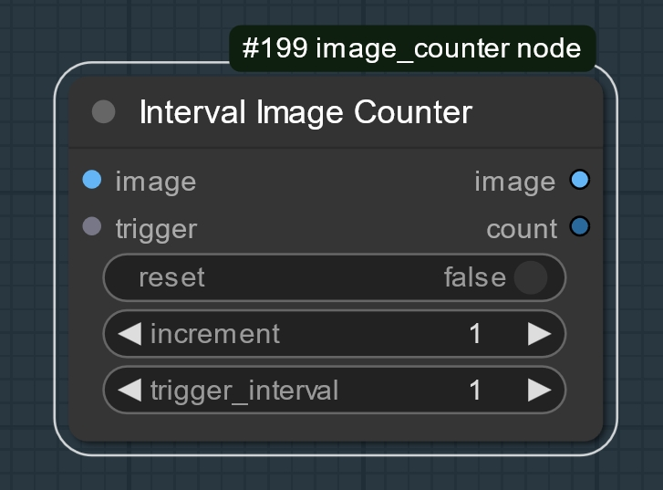

与IntervalCounter A node相似，此节点拥有一个内置计数器，可根据trigger_interval（触发间隔）的输入值来完成在特定触发间隔后才进行常规计数器的递增（increment）特定的数值。但与IntervalCounter A不同的是，此节点内置计数器的触发条件改为当外面接入的图像经过该节点才会触发。

Similar to the IntervalCounter A node, this node has a built-in counter that can increment by a specific value after a certain trigger interval, as input by the trigger_interval. However, unlike the IntervalCounter A, the trigger condition for this node's built-in counter is modified so that it is only triggered when an external image passes through the node.

各项参数详解：（nodes function）

输入端 input side

image：输入的目标图片（一般为加载图片列表或包含多张图片的特定文件夹加载节点）

The target image input (usually a loaded image list or a specific folder loading node that contains multiple images).

trigger：（触发器）（这个端口不用连，仅作为标识而已。触发功能已整合到image端口中）
(Trigger) (This port does not need to be connected, it is only used as an identifier. The trigger functionality has been integrated into the image port.)

reset：重置布尔（可外接布尔值来控制）

Reset Boolean (can be controlled by an external Boolean value)

increment：在特定触发间隔后常规计数器递增的数值（在配套使用时，此数值应与IntervalCounter A node相同）

The value by which the regular counter is incremented after a specific trigger interval (when used in conjunction, this value should be the same as that of the IntervalCounter A node).

trigger_interval：特定触发间隔（在配套使用时，此数值应与IntervalCounter A node相同）（e：当trigger_interval=3，increment=1时，其会在图片第三次经过该节点时节点的最终输出值+1）

The specific trigger interval (when used in conjunction, this value should be the same as that of the IntervalCounter A node) (e.g., when trigger_interval=3 and increment=1, the node's final output value will increase by 1 when the image passes through the node for the third time).

输出端 output side

image：输入的目标图片（这里图片只是经过该节点而已，并不会对图片本身做任何改动）

The target image input (in this case, the image merely passes through the node without any alterations being made to the image itself).

counter：节点常规计数器最终输出的值（一般接到Load prompt from TXT节点的index与trigger输入端来输出该图片对应的prompt内容）

The final output value of the node's regular counter (typically connected to the index and trigger input ports of the Load prompt from TXT node to output the corresponding prompt content for the image).

3：load_prompt_txt node（一般与image_counter node节点配套使用）(Usually used in conjunction with the image_counter node.)

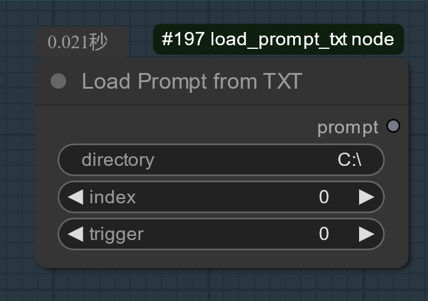

此节点用于外接特定的计数节点传输来的计数值索引来加载该索引值对应的特定文件夹内的txt文件内容。

This node is used to load the content of a txt file within a specific folder corresponding to the index value transmitted from a specific counting node.

各项参数详解：（nodes function）

输入端 input side

index（索引）：外接特定计数器节点传来的索引值

Index value from an external specific counter node

trigger（触发器）：外接特定计数器节点传来的索引值用于触发节点

The index value from an external specific counter node is used to trigger the node.

directory（路径）：包含一系列txt文件的文件夹的绝对路径（注：目前该节点仅支持Windows系统的路径检索，若要兼容Linux系统路径加载的话请自己动手丰衣足食）

The absolute path of a folder containing a series of txt files (Note: currently, this node only supports path retrieval for Windows systems. If you want to load paths compatible with Linux systems, please take matters into your own hands)

输出端 output side

prompt：被检索到的txt文件的所有内容。

All the content of the retrieved txt file.

下面是节点1-3组合，从而实现在特定触发间隔后同时输出特定图片与其对应的正面prompt内容的模块示例：

Here is a module example of the combination of nodes 1-3, which achieves the simultaneous output of specific images and their corresponding positive prompt content after a specific trigger interval:

示例工作流（非重置模式） workflow example（unreset mode）（bool=false，int=0）

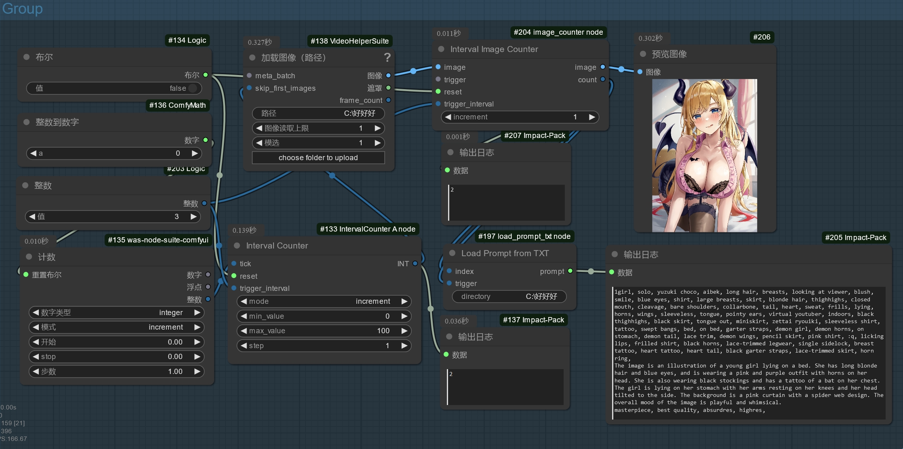

示例工作流（重置模式） workflow example（reset mode）（bool=true，int=1）

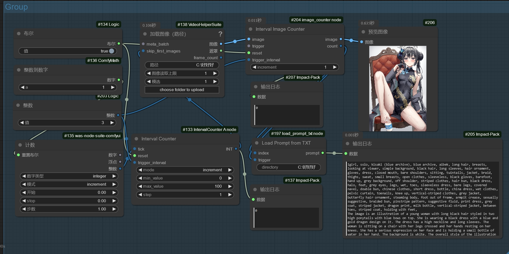

4：IntervalCounter B node

此节点与IntervalCounter A node相似，但在此基础上添加了一个对内部计数器节点计数值通过python表达式进行更改的模式（expression）输入框，你可以在expression输入或外接特定的Python数学表达式来对该节点的内部计数器计算值（value）进行特定的更改。（注：目前expression并未对其输入值做任何其他限定，如果在工作流运行中被输入恶意代码也会照常执行，所以请在启用expression前确保其输入端不会被输入任何不是你希望输入的东西！！！）

This node is similar to the IntervalCounter A node, but on this basis, it adds a mode (expression) input box that allows the internal counter node's count value to be changed through a Python expression. You can input or externally connect specific Python mathematical expressions in the expression box to make specific changes to the internal counter's calculated value (value) of this node. (Note: currently, the expression does not impose any other restrictions on its input values. If malicious code is input during the workflow execution, it will still be executed as normal. Therefore, please ensure that the input end will not receive anything other than what you intend to input before enabling the expression!!!)

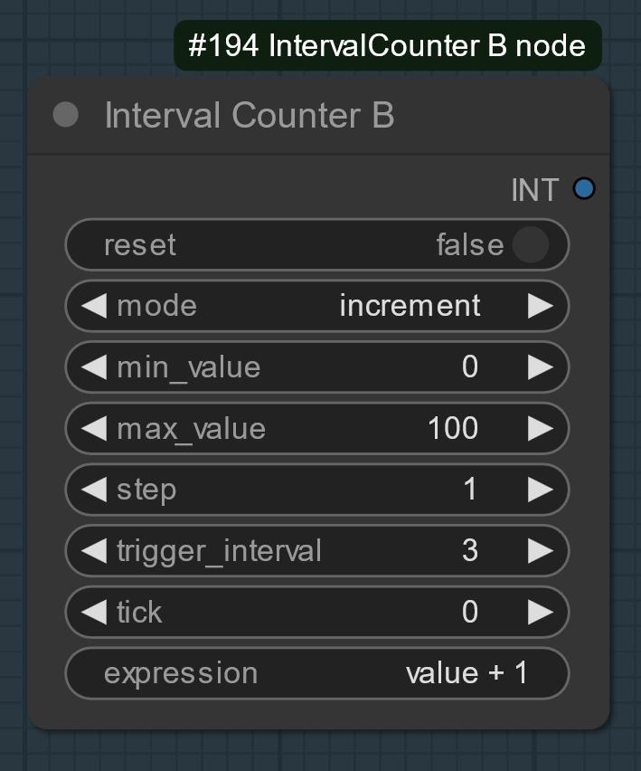

5：alternating_output A node

此节点可用于在外接的计数器节点提供的轮数下按特定的顺序与间隔输出特定的图像的节点。此节点的顺序为：第一轮输出由first_output决定，后面在first_output的后n-2轮输出与first_output相反的图片，最后在first_output的后n轮输出first_output的图片，以此为一个循环，然后以此往复。（e：当n=3，first_output=input_b时，前10轮的图片输出顺序为：BAABAABAAB）（注：此节点第一轮不参与循环，循环在第二轮才开始）

This node can be used to output specific images in a particular order and interval under the number of rounds provided by an external counter node. The sequence of this node is as follows: the first round outputs the image determined by first_output, then in the next n-2 rounds following first_output, the opposite image is output, and finally, in the n-th round after first_output, the image determined by first_output is output again. This forms one cycle, and then it repeats.
(Example: When n=3 and first_output=input_b, the image output order for the first 10 rounds would be: BAABAABAAB)(Note: this node does not participate in the loop during the first round; the loop begins in the second round.)

各项参数详解：（nodes function）

输入端 input side

input_a：可输入的图片A

Input image A

input_b:可输入的图片B

Input image B

n：在first_output图片输出一次后与下一次输出之间的轮数（即走完一个图片AB交替输出循环的轮数，n-1即为与first_output相反的图片在单个循环中所输出的轮数）

The number of rounds between the first output of the first_output image and the next output (i.e., the number of rounds to complete one image A-B alternating output cycle, where n-1 is the number of rounds that the image opposite to first_output is output in a single cycle).

first_output：在第一轮输出的图片（可选input_a或b）

The image output in the first round (optional input_a or b)

counter：外接计数器节点的值

The value of the external counter node.

输出端 output side

image：输出的图片

output image

width：输出图片对应的宽

the width of output image

height：输出图片对应的高

the height of output image

counter：外接计数器节点的值

The value of the external counter node.

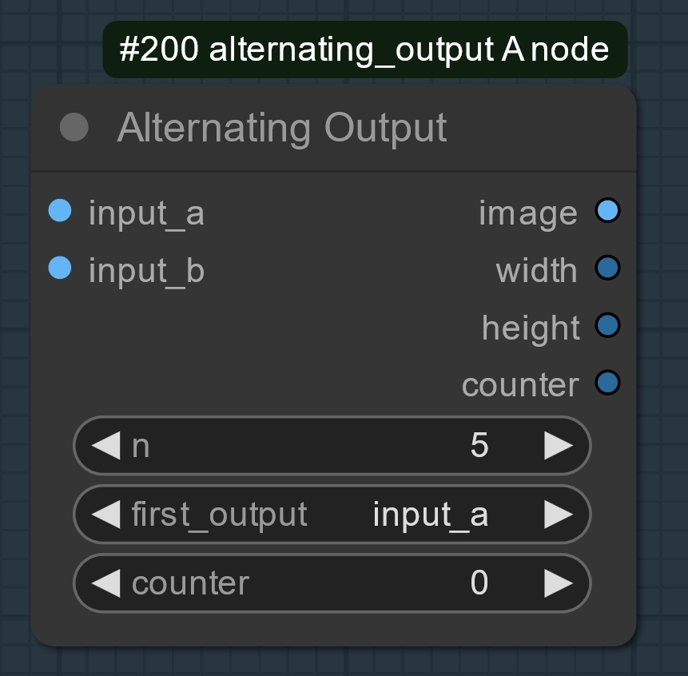 

示例工作流（非重置模式） workflow example（unreset mode）（bool=false，int=0）

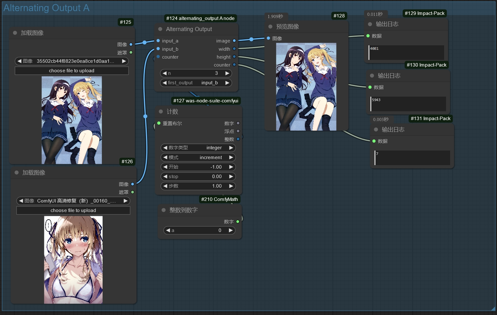

示例工作流（重置模式） workflow example（reset mode）（bool=true，int=1）

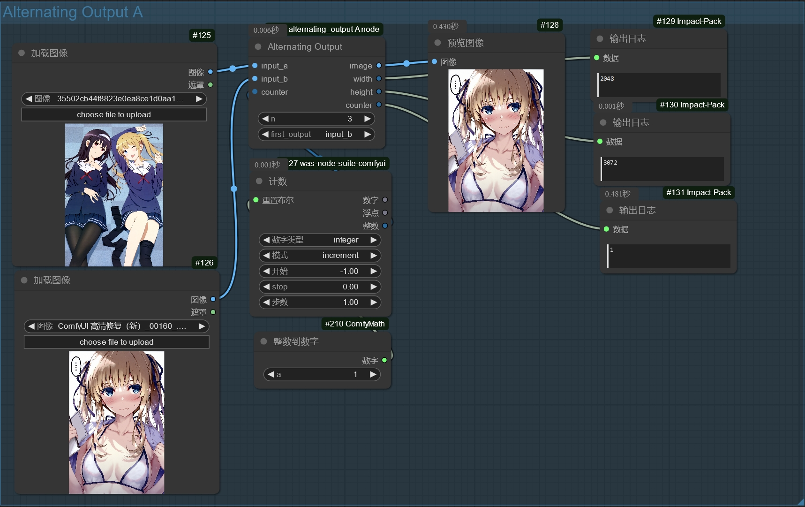

6：alternating_output B node（常用）

此节点与alternating_output A相似，但此节点的顺序为：每个循环的第一轮输出由first_output决定，后面在first_output的后n-1轮输出与first_output相同的图片，最后在first_output的后n轮输出与first_output相反的图片，以此为一个循环，然后以此往复。（e：当n=3，first_output=input_b时，前10轮的图片输出顺序为：BBBABBBABB）（注：此节点的first_output参与循环！在例中条件下，每个循环应为BBBA，即第一个循环的第一个输出值由first_output决定，并由此决定第一个循环的结构，从而奠定后续循环的结构）

This node is similar to alternating_output A, but the order of this node is as follows: the output of the first round of each cycle is determined by first_output. In the subsequent n - 1 rounds after first_output, the same picture as first_output is output. Finally, in the n rounds after first_output, the picture opposite to first_output is output. This constitutes one cycle, and then this pattern repeats. (e: When n = 3 and first_output = input_b, the output order of pictures in the first 10 rounds is: BBBABBBABB) (Note: Under the example conditions in the sentence, each cycle should be BBBA, that is, the first output value of the first cycle is determined by first_output, and the structure of the first cycle is determined accordingly, thus laying the foundation for the structure of subsequent cycles. Indeed, the first_output of this node participates in the cycle.)

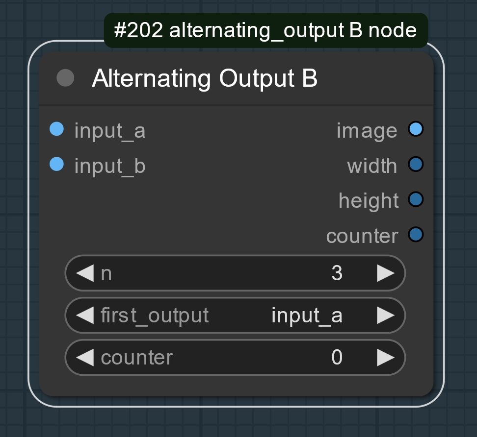

示例工作流（非重置模式） workflow example（unreset mode）（bool=false，int=0）

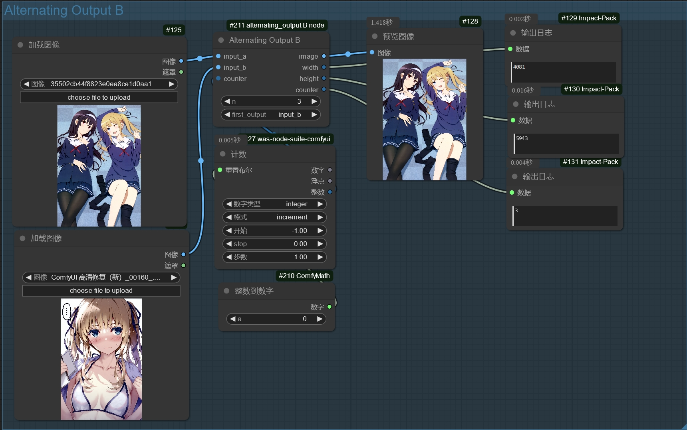

示例工作流（重置模式） workflow example（reset mode）（bool=true，int=1）

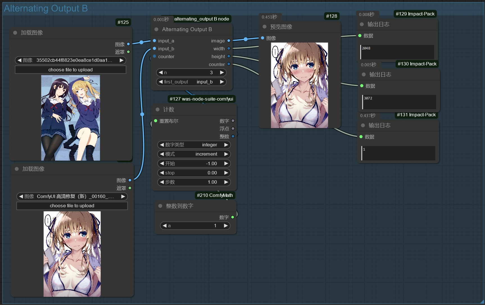

